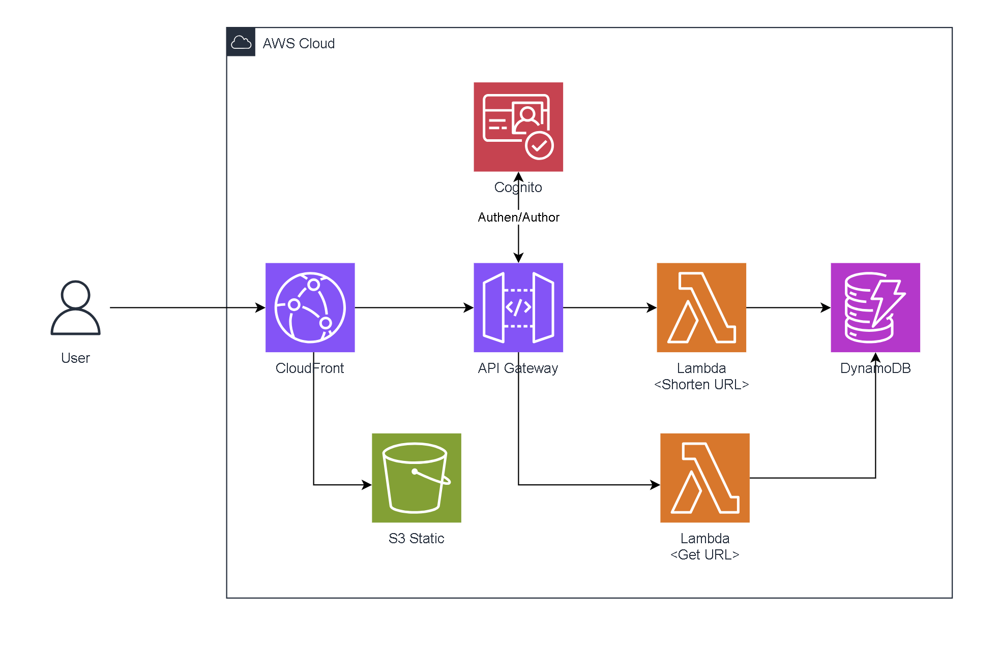
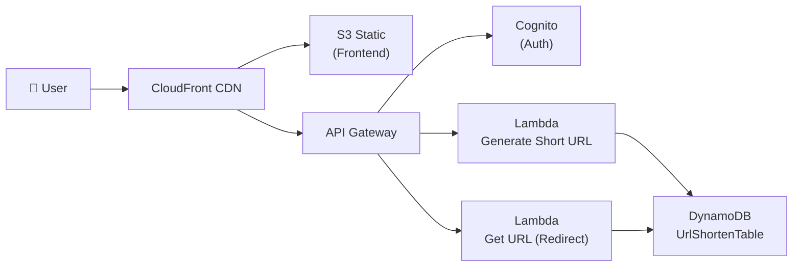
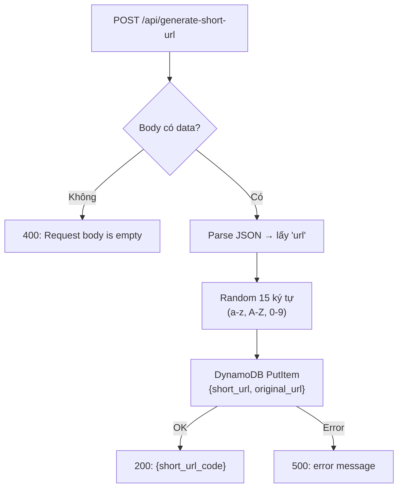
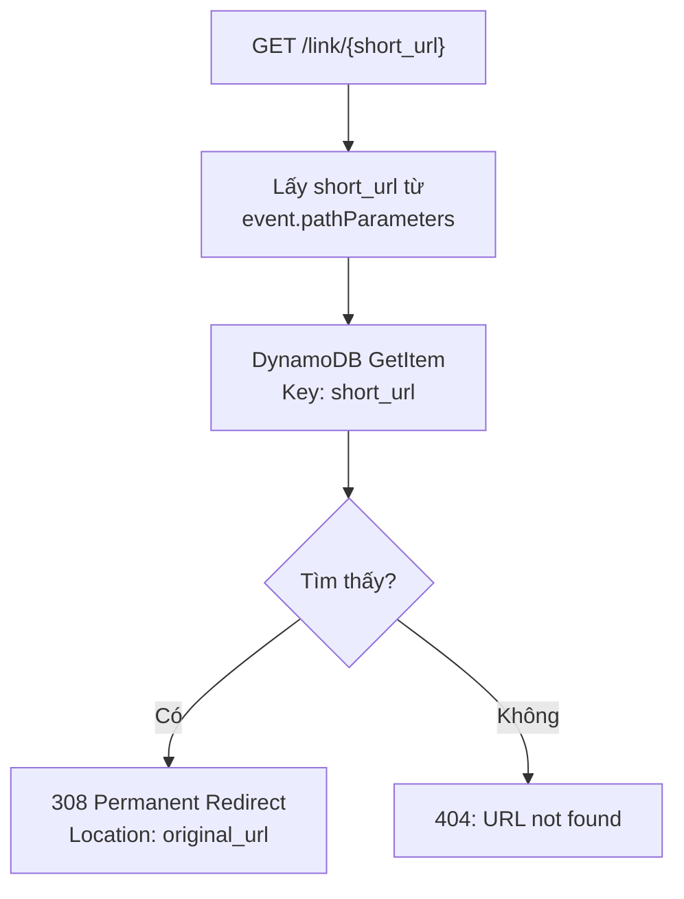
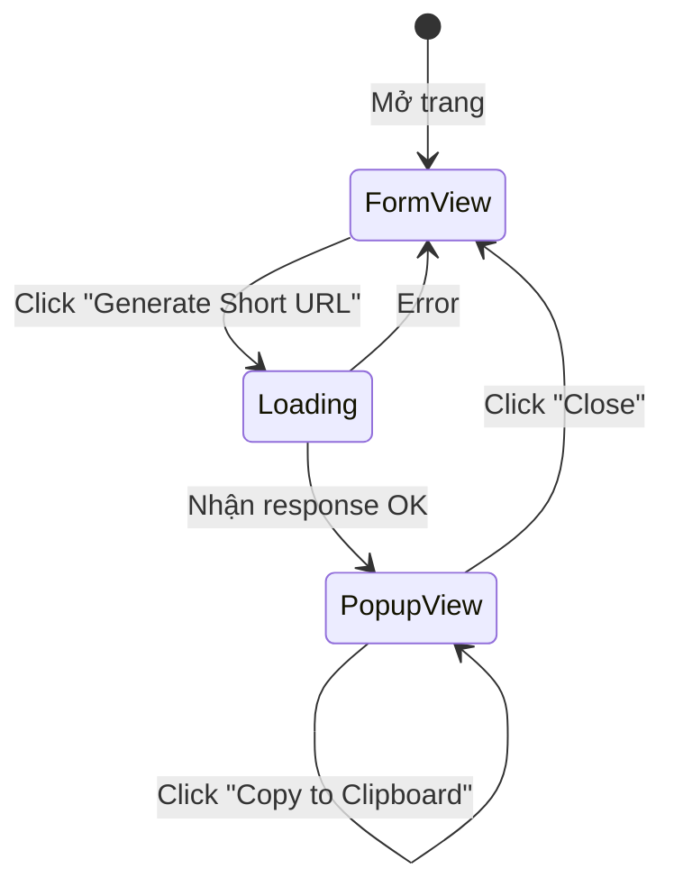
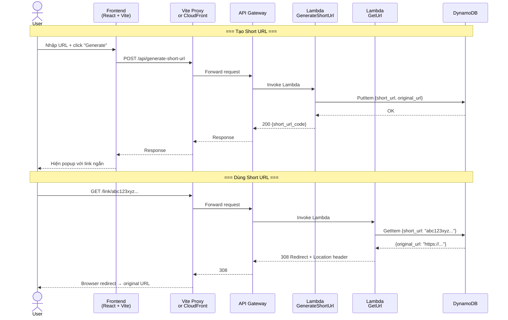

# Shorten Link

Công cụ **rút gọn URL** full-stack, cho phép người dùng:

1. Nhập một URL dài → nhận lại một URL ngắn
2. Truy cập URL ngắn → tự động chuyển hướng (redirect) về URL gốc

**Domain production**: `https://npt-shortenlink.dev`

---

## Kiến Trúc Tổng Quan (AWS Serverless)



Luồng hoạt động chính:



| Thành phần | Vai trò |
|---|---|
| **CloudFront** | CDN, phân phối frontend & route API requests |
| **S3** | Host static files (build frontend React) |
| **API Gateway** | REST API endpoint, route `/api/*` và `/link/*` |
| **Cognito** | Authen/Author (có trong sơ đồ kiến trúc, chưa triển khai trong code) |
| **Lambda (x2)** | Xử lý logic tạo short URL & redirect |
| **DynamoDB** | Lưu trữ mapping `short_url ↔ original_url` |

---

## Cấu Trúc Thư Mục

```text
shorten-link/
├── .gitignore                  # Ignore rules cho cả BE & FE
├── .nvmrc                      # Pin Node.js version → 22.13.1
├── Architecture.png            # Sơ đồ kiến trúc AWS
├── README.md                   # Hướng dẫn chung
│
├── backend/                    # ← AWS SAM Application
│   ├── template.yaml           # SAM/CloudFormation template (định nghĩa toàn bộ infra)
│   ├── samconfig.toml          # Config deploy SAM (region, stack name, ...)
│   ├── requirements.txt        # boto3
│   ├── pytest.ini              # Pytest markers config
│   ├── __init__.py
│   │
│   ├── generate_short_url/     # Lambda #1: Tạo short URL
│   │   ├── __init__.py
│   │   └── app.py              # Handler chính
│   │
│   ├── get_url/                # Lambda #2: Redirect từ short URL
│   │   ├── __init__.py
│   │   └── app.py              # Handler chính
│   │
│   ├── events/
│   │   └── event.json          # Sample API Gateway event (dùng test local)
│   │
│   └── tests/
│       ├── requirements.txt    # pytest, boto3, requests
│       ├── unit/
│       │   └── test_handler.py # 4 unit tests (mock DynamoDB)
│       └── integration/
│           └── test_api_gateway.py  # Live integration test
│
└── frontend/                   # ← React + Vite Application
    ├── package.json            # Dependencies & scripts
    ├── vite.config.js          # Vite config + API proxy
    ├── index.html              # SPA entry point
    ├── .env.example            # Environment variables template
    ├── .env                    # Actual env (git-ignored)
    ├── eslint.config.js        # ESLint flat config (React 18.3)
    ├── public/
    │   └── vite.svg            # Favicon
    └── src/
        ├── main.jsx            # React entry → render <App>
        ├── App.jsx             # Root component → render <ShortenLink>
        ├── ShortenLink.jsx     # Component chính (form + popup)
        └── index.css           # Global styles
```

---

## Yêu Cầu Hệ Thống

| Công cụ | Phiên bản |
|---|---|
| Node.js | 22.x (pin: `22.13.1` trong `.nvmrc`) |
| npm | 11.x |
| Python | 3.12.x (pin: `3.12.4` trong `backend/.python-version`) |
| AWS CLI | Configured with valid credentials |
| AWS SAM CLI | 1.160.1 |

Kiểm tra nhanh:

```bash
node --version     # v22.x
npm --version      # 11.x
python --version   # 3.12.x
aws --version
sam --version      # 1.160.1
aws sts get-caller-identity
```

---

## Backend — Chi Tiết

### Infrastructure (SAM Template)

File [`template.yaml`](backend/template.yaml) định nghĩa toàn bộ AWS resources:

| Resource | Type | Mô tả |
|---|---|---|
| `MyApi` | `AWS::Serverless::Api` | API Gateway, stage `dev`, OpenAPI 2.0 |
| `GenerateShortUrlFunction` | `AWS::Serverless::Function` | Lambda Python 3.12, endpoint `POST /api/generate-short-url` |
| `GetUrlFunction` | `AWS::Serverless::Function` | Lambda Python 3.12, endpoint `GET /link/{short_url}` |
| `LambdaExecutionRole` | `AWS::IAM::Role` | IAM Role cho Lambda, quyền `dynamodb:GetItem` + `dynamodb:PutItem` |
| `UrlShortenTable` | `AWS::DynamoDB::Table` | DynamoDB table, partition key = `short_url` (String), billing = `PAY_PER_REQUEST` |

> [!IMPORTANT]
> DynamoDB table chỉ có **1 attribute** trong key schema: `short_url` (HASH key). Không có sort key. Billing mode là **On-Demand** (PAY_PER_REQUEST) — không cần lo provisioned capacity.

---

### API Endpoints

#### `POST /api/generate-short-url` — Tạo Short URL

File: [`generate_short_url/app.py`](backend/generate_short_url/app.py)



**Logic chi tiết:**

1. Nhận event từ API Gateway, parse `event['body']` (JSON string)
2. Nếu body rỗng → trả `400`
3. Lấy `body['url']` là URL gốc
4. Sinh `short_url` = random 15 ký tự (chữ + số) dùng `random.choices()`
5. Ghi vào DynamoDB table `UrlShortenTable` với `{short_url, original_url}`
6. Trả về `{"short_url_code": "<15-char-code>"}` kèm CORS headers

**Request / Response mẫu:**

```bash
# Request
curl -X POST https://npt-shortenlink.dev/api/generate-short-url \
  -H "Content-Type: application/json" \
  -d '{"url": "https://www.example.com/very-long-path"}'

# Response (200)
{"short_url_code": "aB3xYz7Kp2mN9wQ"}
```

> [!NOTE]
> Chuỗi ngắn dài **15 ký tự**, sử dụng bảng chữ cái `a-zA-Z0-9` (62 ký tự) → `62^15 ≈ 7.7 × 10²⁶` tổ hợp — xác suất trùng cực thấp. Tuy nhiên, code **không kiểm tra trùng lặp** trước khi ghi.

---

#### `GET /link/{short_url}` — Redirect về URL Gốc

File: [`get_url/app.py`](backend/get_url/app.py)



**Logic chi tiết:**

1. Trích `short_url` từ `event['pathParameters']['short_url']`
2. Query DynamoDB bằng `GetItem` với key `short_url`
3. Nếu tìm thấy → trả HTTP **308** (Permanent Redirect) với header `Location: <original_url>`
4. Nếu không tìm thấy → trả **404**

> [!TIP]
> HTTP 308 là "Permanent Redirect" — tương tự 301 nhưng **giữ nguyên method** của request gốc (GET vẫn là GET). Browser sẽ tự động follow redirect.

---

### Deploy Config

File [`samconfig.toml`](backend/samconfig.toml):

| Config | Giá trị |
|---|---|
| **Stack name** | `shorten-link-backend` |
| **Region** | `ap-southeast-1` (Singapore) |
| **Build** | cached + parallel |
| **Deploy** | capability IAM, confirm changeset, disable rollback |
| **Local dev** | warm containers `EAGER` (giảm cold start khi test local) |

---

## Frontend — Chi Tiết

### Tech Stack

| Công nghệ | Version | Vai trò |
|---|---|---|
| React | 18.3.1 | UI library |
| Vite | 5.4.8 | Build tool + dev server |
| ESLint | 9.11.1 | Linting (flat config) |

### Luồng Hoạt Động UI

File chính: [`ShortenLink.jsx`](frontend/src/ShortenLink.jsx)



**States (React hooks):**

| State | Kiểu | Mô tả |
|---|---|---|
| `link` | `string` | URL người dùng nhập vào |
| `shortLink` | `string` | URL ngắn đã sinh (dạng `https://npt-shortenlink.dev/link/<code>`) |
| `showPopup` | `boolean` | Hiện/ẩn popup kết quả |

**Khi user click "Generate Short URL":**

1. `fetch("/api/generate-short-url", { method: "POST", body: { url: link } })`
2. Nhận `{ short_url_code }` → ghép với `VITE_BASE_URL` → `https://npt-shortenlink.dev/link/<code>`
3. Hiện popup với URL ngắn + nút **Copy** + nút **Close**

---

### API Proxy (Vite Dev Server)

File: [`vite.config.js`](frontend/vite.config.js)

```javascript
proxy: {
    "/api":  { target: env.VITE_API_PROXY_TARGET, changeOrigin: true },
    "/link": { target: env.VITE_API_PROXY_TARGET, changeOrigin: true },
}
```

Khi dev local, frontend chạy ở `localhost:5173` nhưng cần gọi API ở `localhost:3000` (SAM local) hoặc production. Vite proxy sẽ forward:

- `/api/*` → `VITE_API_PROXY_TARGET/api/*`
- `/link/*` → `VITE_API_PROXY_TARGET/link/*`

→ Giải quyết vấn đề **CORS** trong development.

---

### Environment Variables

File [`.env.example`](frontend/.env.example):

| Variable | Mục đích | Giá trị production |
|---|---|---|
| `VITE_BASE_URL` | Prefix khi hiển thị short URL cho user | `https://npt-shortenlink.dev` |
| `VITE_API_PROXY_TARGET` | Target cho Vite proxy (dev server) | `https://npt-shortenlink.dev` |

Tạo file `.env` từ template:

```bash
cd frontend
cp .env.example .env
```

Khi chạy local với SAM, đổi cả 2 giá trị thành `http://localhost:3000`.

---

### Styling

File: [`index.css`](frontend/src/index.css)

| Thành phần | Chi tiết |
|---|---|
| Layout | CSS Grid, centered toàn trang (`place-items: center`) |
| Card wrapper | max-width 640px, border-radius 12px, white background |
| Buttons | Blue `#2563eb`, border-radius 8px |
| Popup | Light cyan `#ecfeff`, cyan border `#a5f3fc` |

---

## Luồng Dữ Liệu End-to-End



---

## Quick Start (Local Development)

### 1) Backend

```bash
cd backend
pip install -r requirements.txt
sam build
sam local start-api
```

Backend local URL: `http://127.0.0.1:3000`

Test nhanh:

```bash
curl -X POST http://127.0.0.1:3000/api/generate-short-url \
  -H "Content-Type: application/json" \
  -d '{"url": "https://example.com"}'
```

### 2) Frontend

```bash
cd frontend
cp .env.example .env
# Sửa .env: đổi cả 2 giá trị thành http://localhost:3000 (nếu test local)
npm install
npm run dev
```

Frontend chạy tại: `http://localhost:5173`

---

## Testing

### Unit Tests

File: [`tests/unit/test_handler.py`](backend/tests/unit/test_handler.py) — **4 test cases**, mock DynamoDB bằng `unittest.mock`:

| Test | Kiểm tra |
|---|---|
| `test_generate_short_url_success` | Tạo short URL thành công → 200, code dài 15 ký tự, `put_item` được gọi |
| `test_generate_short_url_missing_body` | Body rỗng → 400 |
| `test_get_url_success` | Tìm thấy URL → 308, Location header đúng |
| `test_get_url_not_found` | Không tìm thấy → 404 |

### Integration Test

File: [`tests/integration/test_api_gateway.py`](backend/tests/integration/test_api_gateway.py):

- Cần biến môi trường `API_BASE_URL` (URL thật đã deploy)
- Gọi POST tới endpoint thật, verify status 200 và có `short_url_code`
- Tự skip nếu không set `API_BASE_URL`

### Chạy Tests

```bash
cd backend
pip install -r tests/requirements.txt

# Chỉ unit tests (integration tự skip)
pytest tests

# Cả unit + integration
API_BASE_URL=https://<deployed-api-base-url> pytest tests
```

---

## Deploy

### Backend (AWS)

```bash
cd backend
sam build              # Build Lambda packages
sam deploy --guided    # Deploy lên AWS (CloudFormation stack)
```

Sau khi deploy, đọc CloudFormation outputs:

- `ApiBaseUrl` — Base URL của API Gateway
- `GenerateShortUrlEndpoint` — Full URL endpoint tạo short URL

### Frontend (Production)

```bash
cd frontend
# Đảm bảo .env đã set giá trị production:
# VITE_BASE_URL=https://npt-shortenlink.dev
# VITE_API_PROXY_TARGET=https://npt-shortenlink.dev
npm run build          # Output → frontend/dist/
```

Deploy thư mục `frontend/dist/` lên static hosting (S3 + CloudFront, Netlify, Vercel, etc.).

### Cleanup

Xóa toàn bộ resources đã deploy:

```bash
cd backend
sam delete --stack-name shorten-link-backend
```

---

## Lưu Ý Quan Trọng

> [!WARNING]
> **Cognito** xuất hiện trong sơ đồ kiến trúc nhưng **chưa được triển khai** trong code. Hiện tại API hoàn toàn public, không có authentication/authorization.

> [!NOTE]
> - Code **không check trùng lặp** short URL trước khi ghi DynamoDB. Với 15 ký tự random (62^15 tổ hợp), xác suất collision cực thấp nhưng về mặt lý thuyết vẫn có thể xảy ra.
> - CORS headers được set trực tiếp trong Lambda response (wildcard `*`), không qua API Gateway config.
> - Frontend dùng **fetch API** thuần, không dùng thư viện HTTP nào (axios, etc.).
> - `package.json` có một số devDependencies thừa từ webpack (`babel-loader`, `html-webpack-plugin`, `webpack`, `webpack-cli`, `webpack-dev-server`) — project ban đầu dùng webpack rồi chuyển sang Vite.
> - Domain hiện tại: `https://npt-shortenlink.dev`. Giữ secret keys ngoài repository files.
