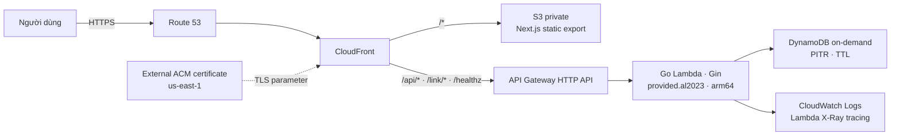
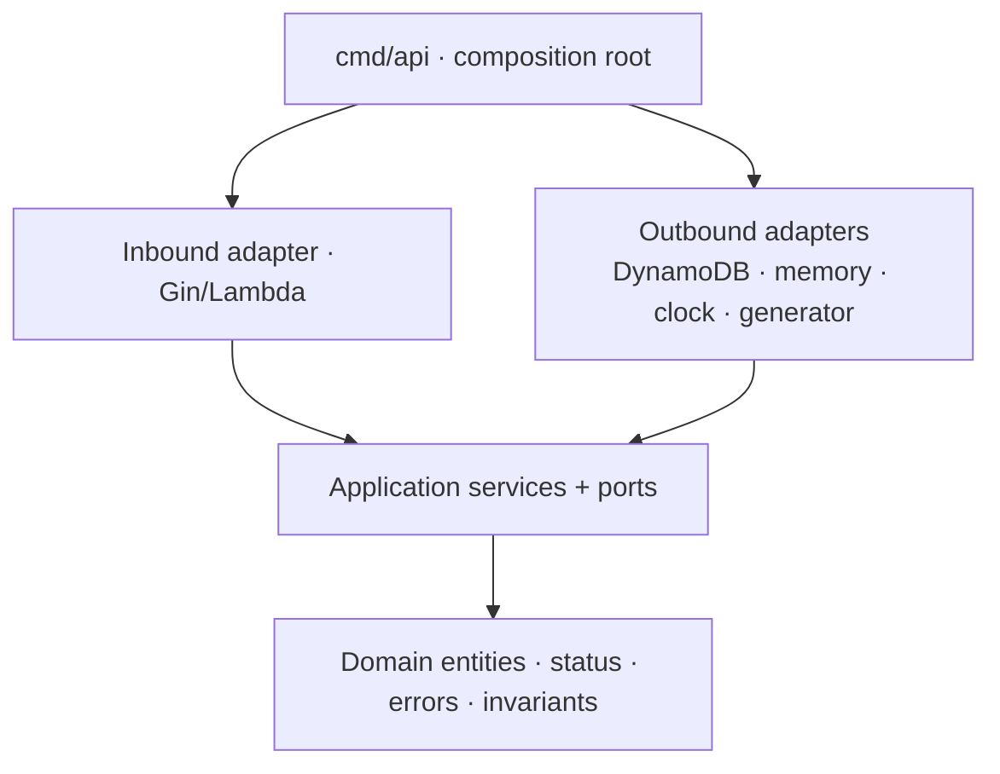

<div align="center">

# NPT ShortenLink

**A serverless URL shortener built to stay simple at the edge and explicit in the code.**

Rút gọn URL, chọn alias, đặt thời hạn và resolve link qua một domain duy nhất —
với frontend tĩnh, API serverless và hạ tầng được mô tả bằng AWS SAM/CloudFormation.

[](https://github.com/TrieuNguyenPhu/shorten-link/actions/workflows/ci.yml)

`Domain reserved: npt-shortenlink.dev` ·
[Kiến trúc](docs/architecture.md) ·
[OpenAPI](openapi/openapi.yaml) ·
[Hallmark QA](docs/hallmark-qa.md) ·
[Kế hoạch triển khai](docs/implementation-plan.md)

</div>

> [!IMPORTANT]
> `main` là source hoàn chỉnh của v2: Next.js, Go/Gin, OpenAPI và AWS SAM.
> Bản v1 Python/React không được khôi phục và chỉ tồn tại dưới dạng snapshot
> lịch sử.

| Track | Trạng thái | Stack chính | Tham chiếu |
|---|---|---|---|
| **v2 — current** | Source, tests, CI và deployment workflow đã có trên `main`; public deployment vẫn là thao tác có chủ đích của operator | Next.js, Go/Gin, OpenAPI, DynamoDB và AWS SAM | `main`, [kiến trúc](docs/architecture.md), [AWS runbook](infra/aws/README.md) |
| **v1 — archived baseline** | Snapshot chỉ đọc, không còn trong cây source hiện tại | Python 3.12 Lambda, React/Vite, API Gateway REST, DynamoDB, AWS SAM | [`cv-2026-06-python-react-sam`](https://github.com/TrieuNguyenPhu/shorten-link/tree/cv-2026-06-python-react-sam) |

> [!NOTE]
> `npt-shortenlink.dev` là canonical domain đã đăng ký. Public deployment đang
> phụ thuộc AWS account, hosted zone và certificate của operator. Source/IaC có
> trong repository không được hiểu là production đang online.

## Vì sao project này tồn tại?

URL shortener nhìn nhỏ, nhưng là một bài toán đủ tốt để thể hiện những quyết định
khó thấy trong CRUD thông thường: collision, redirect caching, TTL bất đồng bộ,
validation ở trust boundary, cấu trúc Lambda, CDN routing và khả năng rollback.

V2 tập trung vào bốn mục tiêu:

- **Redirect đúng trước, analytics sau:** đường nóng chỉ đi qua CloudFront, HTTP API, Lambda và DynamoDB.
- **Domain độc lập framework:** rule tạo/resolve link có thể test mà không khởi động Gin hoặc AWS.
- **Một contract HTTP:** frontend, local server và Lambda cùng tuân theo [`openapi/openapi.yaml`](openapi/openapi.yaml).
- **Hạ tầng tái lập được:** API, storage, static hosting, CDN và DNS đều nằm trong SAM/CloudFormation.

## Khả năng chính

| Khả năng | v1 baseline | v2 source hiện tại |
|---|:---:|:---:|
| Tạo short URL và redirect | Có | Có |
| Custom alias | — | Có, `4–32` ký tự thường/số/gạch ngang |
| Expiration | — | Có, `1–365` ngày + DynamoDB TTL |
| Metadata/status API | — | Có: `active`, `expired`, `disabled` |
| Collision-safe create | Random code xác suất lớn | Conditional write + retry hữu hạn |
| Static frontend | React/Vite | Next.js static export |
| Backend runtime | 2 Python Lambda | 1 Go Lambda chạy local hoặc Lambda |
| Infrastructure as code | SAM cho backend | SAM cho API, Lambda, DynamoDB, S3, CloudFront và Route 53 |
| UI release gate | Manual review | Hallmark + browser evidence bắt buộc |

## Kiến trúc v2

Sơ đồ dưới đây mô tả **resource và wiring đã có trong source SAM v2**, không phải
tuyên bố rằng rebuild đã được deploy production. ACM certificate là prerequisite
được truyền vào stack qua parameter, không phải resource do template tạo.


```mermaid
flowchart LR
    User["Người dùng"] -->|HTTPS| DNS["Route 53"]
    DNS --> Edge["CloudFront"]
    ACM["External ACM certificate\nus-east-1"] -. TLS parameter .-> Edge

    Edge -->|"/*"| Web["S3 private\nNext.js static export"]
    Edge -->|"/api/* · /link/* · /healthz"| API["API Gateway HTTP API"]
    API --> Lambda["Go Lambda · Gin\nprovided.al2023 · arm64"]
    Lambda --> Table["DynamoDB on-demand\nPITR · TTL"]
    Lambda --> Observe["CloudWatch Logs\nLambda X-Ray tracing"]
```

| Thành phần | Trách nhiệm |
|---|---|
| **CloudFront** | Phân phối static assets và route `/api/*`, `/link/*`, `/healthz` cùng origin |
| **S3 + OAC** | Lưu Next.js static export trong bucket private, chỉ CloudFront được đọc |
| **API Gateway HTTP API** | Nhận request v2 và chuyển payload sang Lambda |
| **Go Lambda + Gin** | Validation, use case orchestration, error mapping và redirect |
| **DynamoDB** | Lưu link theo partition key `code`, conditional create, PITR và TTL |
| **Route 53 + ACM** | Stack tạo alias A/AAAA; certificate TLS có sẵn được truyền qua parameter |

CloudFront production dùng relative request nên browser không cần biết execute-api
URL. Local frontend mới dùng `NEXT_PUBLIC_API_BASE_URL=http://localhost:8080`.

<details>
<summary><strong>Dependency rule của Go clean architecture</strong></summary>


```mermaid
flowchart TB
    Bootstrap["cmd/api · composition root"] --> HTTP["Inbound adapter · Gin/Lambda"]
    Bootstrap --> Adapters["Outbound adapters\nDynamoDB · memory · clock · generator"]
    HTTP --> App["Application services + ports"]
    Adapters --> App
    App --> Domain["Domain entities · status · errors · invariants"]
```

- `internal/domain` không biết JSON, HTTP, Gin hoặc AWS SDK.
- `internal/application` định nghĩa use case và outbound ports.
- `internal/adapters` triển khai HTTP, persistence, clock và code generation.
- `cmd/api` chọn memory repository khi chạy local và DynamoDB khi chạy Lambda.

</details>

<details>
<summary><strong>v1 architecture được mô tả trong CV</strong></summary>

V1 dùng React/Vite trên S3/CloudFront, API Gateway REST, hai Python Lambda và
DynamoDB on-demand. SAM v1 định nghĩa phần backend; topology S3/CloudFront được
ghi lại trong README và sơ đồ kiến trúc của release.

- [README v1](https://github.com/TrieuNguyenPhu/shorten-link/blob/cv-2026-06-python-react-sam/README.md)
- [Architecture.png v1](https://github.com/TrieuNguyenPhu/shorten-link/blob/cv-2026-06-python-react-sam/Architecture.png)

</details>

## Tech stack

| Lớp | Công nghệ | Phiên bản/pattern |
|---|---|---|
| Web | Next.js, React, TypeScript | Next `16.2.11`, React `19.2.8`, App Router, static export |
| API | Go, Gin | Go `1.26.5`, Gin `1.12.0`, clean architecture |
| Contract | OpenAPI | OpenAPI `3.0.3`, contract version `1.0.0` |
| Runtime target | AWS Lambda | `provided.al2023`, `arm64` |
| Edge target | CloudFront, S3 OAC, Route 53, ACM | Same-origin static + API routing |
| Data target | DynamoDB | `PAY_PER_REQUEST`, PITR, SSE, TTL |
| IaC | AWS SAM/CloudFormation | SAM CLI `1.164.0` đã dùng trong CI |
| Tooling | pnpm, GNU Make, CodeGraph | pnpm `10.33.2`, root developer entrypoint |

## Repository map

```text
shorten-link/
├── apps/web/                    # Next.js static frontend
├── services/shortener-api/      # Go/Gin API, Lambda entrypoint và tests
├── infra/aws/                   # SAM template và operator runbook
├── openapi/                     # Source-of-truth HTTP contract
├── docs/                        # Architecture, delivery and Hallmark QA
├── scripts/deploy-aws.mjs       # Cross-platform guarded deployment workflow
├── .github/workflows/           # Quality and security gates
├── Makefile                     # Repository-level commands
├── go.work                      # Go workspace
└── pnpm-workspace.yaml          # Frontend workspace
```

## Bắt đầu nhanh trên local

| Công cụ | Phiên bản |
|---|---:|
| Node.js | `>=22.20.0` |
| pnpm | `10.33.2` |
| Go | `>=1.26.5` |
| GNU Make | phiên bản hỗ trợ job song song (`-j`) |

```bash
git clone https://github.com/TrieuNguyenPhu/shorten-link.git
cd shorten-link

make install
make dev
```

- Frontend: `http://localhost:3000`
- Backend health: `http://localhost:8080/healthz`

`make dev` chạy frontend và backend song song; `Ctrl+C` dừng cả hai. Local API
mặc định dùng memory repository, nên không cần AWS hoặc DynamoDB.

| Nhu cầu | Lệnh |
|---|---|
| Chỉ backend Go/Gin | `make dev-backend` |
| Chỉ frontend Next.js | `make dev-frontend` |
| Cả frontend và backend | `make dev` hoặc `make dev-all` |

Trong development, frontend mặc định gọi `http://localhost:8080`. Có thể đổi
bằng `NEXT_PUBLIC_API_BASE_URL`; backend cho phép origin local
`http://localhost:3000` theo mặc định.

## HTTP API

| Method | Route | Success | Mục đích |
|---|---|---:|---|
| `POST` | `/api/v1/links` | `201` | Tạo random code hoặc custom alias |
| `GET` | `/api/v1/links/{code}` | `200` | Đọc metadata và trạng thái hiện tại |
| `GET` | `/link/{code}` | `302` | Redirect link đang active |
| `GET` | `/healthz` | `200` | Liveness của process/router |

Success response dùng envelope `data`; lỗi ứng dụng dùng envelope `error`:

```json
{
  "data": {
    "code": "example-docs",
    "short_url": "http://localhost:8080/link/example-docs",
    "target_url": "https://example.com/docs",
    "status": "active",
    "created_at": "2026-07-23T00:00:00Z",
    "expires_at": "2026-08-22T00:00:00Z"
  }
}
```

Contract đầy đủ, schema lỗi và examples nằm tại
[`openapi/openapi.yaml`](openapi/openapi.yaml).

## Kiểm chứng

```bash
# Frontend tests/lint/build
make verify

# Thêm dependency audit và OpenAPI lint
make verify-all
```

Các target hữu ích khác:

| Lệnh | Kiểm tra/thao tác |
|---|---|
| `make test` | Frontend và backend tests |
| `make security` | pnpm dependency audit và Go vulnerability scan |
| `make openapi-lint` | Redocly lint với version đã pin |
| `make codegraph-status` | Trạng thái graph code local |

> [!NOTE]
> Hallmark là release gate, không phải một npm script. Báo cáo browser gần nhất,
> viewport matrix và ảnh bằng chứng nằm tại
> [`docs/hallmark-report.md`](docs/hallmark-report.md).

## AWS build và deploy

Sau khi clone, một operator có thể verify, deploy infrastructure, upload
frontend, invalidate CloudFront và chạy smoke test bằng **một lệnh Make**.
Repository không thể tự tạo AWS credentials, quyền IAM, hosted zone hoặc ACM
certificate; các prerequisite bên ngoài này phải tồn tại trước.

Yêu cầu thêm cho deployment:

| Công cụ/tài nguyên | Yêu cầu |
|---|---|
| AWS CLI | Đã authenticate bằng credential chain hoặc `AWS_PROFILE` |
| AWS SAM CLI | `1.164.0` hoặc compatible |
| Route 53 | Public hosted zone chứa domain deploy |
| ACM | Certificate `us-east-1` bao phủ domain CloudFront |

Kiểm tra toàn bộ plan mà không thay đổi AWS:

```bash
make deploy-dry-run CERTIFICATE_ARN=arn:aws:acm:us-east-1:123456789012:certificate/replace-me HOSTED_ZONE_ID=ZREPLACE_ME
```

Deploy thật bằng một lệnh:

```bash
make deploy CERTIFICATE_ARN=arn:aws:acm:us-east-1:123456789012:certificate/replace-me HOSTED_ZONE_ID=ZREPLACE_ME
```

Giá trị mặc định:

- region: `ap-southeast-1`;
- stack: `npt-shortenlink-prod`;
- environment: `prod`;
- domain: `npt-shortenlink.dev`;
- CORS origin: `https://<domain>`.

Có thể override ngay trên cùng lệnh bằng `AWS_PROFILE`, `AWS_REGION`,
`STACK_NAME`, `ENVIRONMENT_NAME`, `DOMAIN_NAME` hoặc
`CORS_ALLOWED_ORIGINS`. Ví dụ:

```bash
make deploy AWS_PROFILE=portfolio DOMAIN_NAME=links.example.com CERTIFICATE_ARN=arn:aws:acm:us-east-1:123456789012:certificate/replace-me HOSTED_ZONE_ID=ZREPLACE_ME
```

`make deploy` dừng ngay khi preflight, test, lint, audit, OpenAPI, SAM build,
CloudFormation, upload, invalidation hoặc smoke test thất bại. Chi tiết resource,
cache policy và rollback nằm trong [AWS runbook](infra/aws/README.md).

## Tái lập snapshot v1 đã lưu trữ

Không cần thay đổi working tree v2. Tạo một worktree riêng từ versioned baseline tag:

```bash
git worktree add ../shorten-link-v1 cv-2026-06-python-react-sam
cd ../shorten-link-v1

python -m pip install -r backend/requirements.txt -r backend/tests/requirements.txt
python -m pytest backend/tests

npm --prefix frontend ci
npm --prefix frontend run lint
npm --prefix frontend run build

cd backend
sam validate --lint
sam build
```

Live integration test v1 là opt-in và tự skip khi không có `API_BASE_URL`.

## Trạng thái và ranh giới hiện tại

| Đã có trên `main` | Không được ngầm suy diễn |
|---|---|
| Next.js static frontend, Go/Gin API và OpenAPI contract | Production đang online hoặc domain đã cut over |
| SAM resources cho Lambda, DynamoDB, S3, CloudFront và Route 53 | AWS account/credential/certificate đã được cấp |
| CI cho frontend, backend, dependency và SAM build | WAF, authentication, analytics hoặc live SLA |
| Guarded one-command deployment và rollback runbook | Deployment tự động chạy trong pull request |

API MVP hiện chưa có authentication. WAF, auth, analytics và observability nâng
cao chỉ được thêm khi có use case và acceptance criteria riêng; chúng không được
ngầm coi là đã triển khai chỉ vì xuất hiện trong tài liệu kiến trúc đích.

## Release strategy

1. **Một source hoạt động:** mọi thay đổi mới nhắm vào v2 trên `main`; v1 chỉ còn là snapshot lịch sử.
2. **PR nhỏ và có gate:** mỗi capability có branch, commit, test và PR riêng; không dùng aggregate PR.
3. **Staging trước production:** build đúng artifact, chạy smoke test `POST → GET → 302` và xác minh log/rollback trước cutover.
4. **Cutover có đường lui:** chỉ đổi CloudFront/domain traffic khi staging đạt tiêu chí trong implementation plan.
5. **Không suy diễn trạng thái:** source/IaC đã có không đồng nghĩa stack public, WAF, alarm hoặc SLA đã vận hành.

## Tài liệu

- [System architecture](docs/architecture.md)
- [Implementation plan](docs/implementation-plan.md)
- [Backend/infra incremental PR plan](docs/backend-infra-pr-plan.md)
- [OpenAPI contract](openapi/openapi.yaml)
- [Hallmark QA process](docs/hallmark-qa.md)
- [Current Hallmark report](docs/hallmark-report.md)
- [Frontend guide](apps/web/README.md)

## Tham khảo

- [`nghiadaulau/serverless-url-shortener-aws`](https://github.com/nghiadaulau/serverless-url-shortener-aws) — pattern serverless/AWS ban đầu.
- [`Nutlope/hallmark`](https://github.com/Nutlope/hallmark) — kỷ luật thiết kế và quy trình chống giao diện rập khuôn.
- [`colbymchenry/codegraph`](https://github.com/colbymchenry/codegraph) — graph code local phục vụ navigation và impact analysis.

## License

Repository được công khai để phục vụ portfolio và technical review. Chưa có
open-source license hoặc quyền tái phân phối được cấp.
