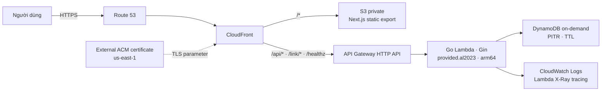
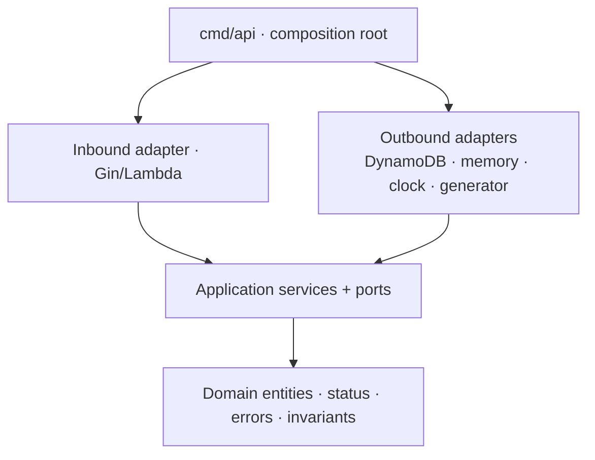

<div align="center">

# NPT ShortenLink

**A serverless URL shortener built to stay simple at the edge and explicit in the code.**

Rút gọn URL, chọn alias, đặt thời hạn và resolve link qua một domain duy nhất —
với frontend tĩnh, API serverless và hạ tầng được mô tả bằng AWS SAM/CloudFormation.

[](https://github.com/TrieuNguyenPhu/shorten-link/actions/workflows/ci.yml)

`Domain reserved: npt-shortenlink.dev` ·
[Kiến trúc](docs/architecture.md) ·
[OpenAPI](openapi/openapi.yaml) ·
[Hallmark QA](docs/hallmark-qa.md) ·
[Kế hoạch triển khai](docs/implementation-plan.md)

</div>

> [!IMPORTANT]
> `main` hiện chỉ chứa hệ thống **v2 Go/Gin + Next.js**. Bản **v1 tháng
> 06/2026** đã được loại khỏi cây source hoạt động và chỉ còn là snapshot lịch
> sử bất biến để đối chiếu hoặc tái lập khi cần.

| Track | Trạng thái | Stack chính | Tham chiếu |
|---|---|---|---|
| **v2 — current source** | Đã kiểm chứng local/CI, chưa tuyên bố public production | Go/Gin, Next.js, API Gateway HTTP API, DynamoDB, S3, CloudFront, AWS SAM | `main` và [trạng thái triển khai](docs/implementation-plan.md) |
| **v1 — archived baseline** | Snapshot chỉ đọc, không còn trong cây source hiện tại | Python 3.12 Lambda, React/Vite, API Gateway REST, DynamoDB, AWS SAM | [`cv-2026-06-python-react-sam`](https://github.com/TrieuNguyenPhu/shorten-link/tree/cv-2026-06-python-react-sam) |

> [!NOTE]
> `npt-shortenlink.dev` là canonical domain đã đăng ký. Public deployment đang
> được dựng lại; Quick Start bên dưới là cách tái lập demo đáng tin cậy hiện tại.

## Vì sao project này tồn tại?

URL shortener nhìn nhỏ, nhưng là một bài toán đủ tốt để thể hiện những quyết định
khó thấy trong CRUD thông thường: collision, redirect caching, TTL bất đồng bộ,
validation ở trust boundary, cấu trúc Lambda, CDN routing và khả năng rollback.

V2 tập trung vào bốn mục tiêu:

- **Redirect đúng trước, analytics sau:** đường nóng chỉ đi qua CloudFront, HTTP API, Lambda và DynamoDB.
- **Domain độc lập framework:** rule tạo/resolve link có thể test mà không khởi động Gin hoặc AWS.
- **Một contract HTTP:** frontend, local server và Lambda cùng tuân theo [`openapi/openapi.yaml`](openapi/openapi.yaml).
- **Hạ tầng tái lập được:** API, storage, static hosting, CDN và DNS đều nằm trong SAM/CloudFormation.

## Khả năng chính

| Khả năng | v1 baseline | v2 source hiện tại |
|---|:---:|:---:|
| Tạo short URL và redirect | Có | Có |
| Custom alias | — | Có, `4–32` ký tự thường/số/gạch ngang |
| Expiration | — | Có, `1–365` ngày + DynamoDB TTL |
| Metadata/status API | — | Có: `active`, `expired`, `disabled` |
| Collision-safe create | Random code xác suất lớn | Conditional write + retry hữu hạn |
| Static frontend | React/Vite | Next.js static export |
| Backend runtime | 2 Python Lambda | 1 Go Lambda chạy local hoặc Lambda |
| Infrastructure as code | SAM cho backend | SAM cho API, Lambda, DynamoDB, S3, CloudFront và Route 53 |
| UI release gate | Manual review | Hallmark + browser evidence bắt buộc |

## Kiến trúc v2

Sơ đồ dưới đây mô tả **resource và wiring đã có trong source SAM v2**, không phải
tuyên bố rằng rebuild đã được deploy production. ACM certificate là prerequisite
được truyền vào stack qua parameter, không phải resource do template tạo.


```mermaid
flowchart LR
    User["Người dùng"] -->|HTTPS| DNS["Route 53"]
    DNS --> Edge["CloudFront"]
    ACM["External ACM certificate\nus-east-1"] -. TLS parameter .-> Edge

    Edge -->|"/*"| Web["S3 private\nNext.js static export"]
    Edge -->|"/api/* · /link/* · /healthz"| API["API Gateway HTTP API"]
    API --> Lambda["Go Lambda · Gin\nprovided.al2023 · arm64"]
    Lambda --> Table["DynamoDB on-demand\nPITR · TTL"]
    Lambda --> Observe["CloudWatch Logs\nLambda X-Ray tracing"]
```

| Thành phần | Trách nhiệm |
|---|---|
| **CloudFront** | Phân phối static assets và route `/api/*`, `/link/*`, `/healthz` cùng origin |
| **S3 + OAC** | Lưu Next.js static export trong bucket private, chỉ CloudFront được đọc |
| **API Gateway HTTP API** | Nhận request v2 và chuyển payload sang Lambda |
| **Go Lambda + Gin** | Validation, use case orchestration, error mapping và redirect |
| **DynamoDB** | Lưu link theo partition key `code`, conditional create, PITR và TTL |
| **Route 53 + ACM** | Stack tạo alias A/AAAA; certificate TLS có sẵn được truyền qua parameter |

CloudFront production dùng relative request nên browser không cần biết execute-api
URL. Local frontend mới dùng `NEXT_PUBLIC_API_BASE_URL=http://localhost:8080`.

<details>
<summary><strong>Dependency rule của Go clean architecture</strong></summary>


```mermaid
flowchart TB
    Bootstrap["cmd/api · composition root"] --> HTTP["Inbound adapter · Gin/Lambda"]
    Bootstrap --> Adapters["Outbound adapters\nDynamoDB · memory · clock · generator"]
    HTTP --> App["Application services + ports"]
    Adapters --> App
    App --> Domain["Domain entities · status · errors · invariants"]
```

- `internal/domain` không biết JSON, HTTP, Gin hoặc AWS SDK.
- `internal/application` định nghĩa use case và outbound ports.
- `internal/adapters` triển khai HTTP, persistence, clock và code generation.
- `cmd/api` chọn memory repository khi chạy local và DynamoDB khi chạy Lambda.

</details>

<details>
<summary><strong>v1 architecture được mô tả trong CV</strong></summary>

V1 dùng React/Vite trên S3/CloudFront, API Gateway REST, hai Python Lambda và
DynamoDB on-demand. SAM v1 định nghĩa phần backend; topology S3/CloudFront được
ghi lại trong README và sơ đồ kiến trúc của release.

- [README v1](https://github.com/TrieuNguyenPhu/shorten-link/blob/cv-2026-06-python-react-sam/README.md)
- [Architecture.png v1](https://github.com/TrieuNguyenPhu/shorten-link/blob/cv-2026-06-python-react-sam/Architecture.png)

</details>

## Tech stack

| Lớp | Công nghệ | Phiên bản/pattern |
|---|---|---|
| Web | Next.js, React, TypeScript | Next `16.2.12`, React `19.2.8`, TypeScript `6.0.3`, App Router, static export |
| API | Go, Gin | Go `1.26.5`, Gin `1.12.0`, clean architecture |
| Contract | OpenAPI | OpenAPI `3.0.3`, contract version `1.0.0` |
| Runtime | AWS Lambda | `provided.al2023`, `arm64` |
| Edge | CloudFront, S3 OAC, Route 53, ACM | Same-origin static + API routing |
| Data | DynamoDB | `PAY_PER_REQUEST`, PITR, SSE, TTL |
| IaC | AWS SAM/CloudFormation | Custom Makefile Lambda builder |
| Tooling | Node.js, pnpm, GNU Make, CodeGraph | Node.js `24.18.0` LTS, pnpm `11.17.0`, root developer entrypoint |

## Repository map

```text
shorten-link/
├── apps/web/                    # Next.js static frontend
├── services/shortener-api/      # Go/Gin API + clean architecture
├── infra/aws/                   # SAM/CloudFormation stack
├── openapi/                     # Source-of-truth HTTP contract
├── docs/                        # Architecture, delivery and Hallmark QA
├── .github/workflows/           # Quality and security gates
├── Makefile                     # Repository-level commands
├── go.work                      # Go workspace
└── pnpm-workspace.yaml          # Frontend workspace
```

## Chạy v2 local

### Yêu cầu

| Công cụ | Phiên bản |
|---|---:|
| Node.js | `24.18.0` LTS |
| pnpm | `11.17.0` |
| Go | `1.26.5` |
| GNU Make | Tuỳ chọn khi chạy local; bắt buộc để `sam build` Lambda artifact |

### Cách nhanh nhất

```bash
pnpm install --frozen-lockfile
make dev
```

- Web: `http://localhost:3000`
- API: `http://localhost:8080`
- Health: `http://localhost:8080/healthz`

`make dev` chạy cả hai process. Nếu muốn log tách riêng, dùng hai terminal:

```bash
# terminal 1
pnpm dev:api

# terminal 2
pnpm dev:web
```

Backend local mặc định dùng **in-memory repository**, vì vậy dữ liệu sẽ mất khi
restart process. Không cần AWS credentials hoặc DynamoDB để phát triển UI/API.

### Tạo link thử

```bash
curl -X POST http://localhost:8080/api/v1/links \
  -H "Content-Type: application/json" \
  -d '{
    "url": "https://example.com/docs",
    "custom_alias": "example-docs",
    "expires_in_days": 30
  }'
```

Sau đó mở:

```text
http://localhost:8080/link/example-docs
```

## HTTP API

| Method | Route | Success | Mục đích |
|---|---|---:|---|
| `POST` | `/api/v1/links` | `201` | Tạo random code hoặc custom alias |
| `GET` | `/api/v1/links/{code}` | `200` | Đọc metadata và trạng thái hiện tại |
| `GET` | `/link/{code}` | `302` | Redirect link đang active |
| `GET` | `/healthz` | `200` | Liveness của process/router |

Success response dùng envelope `data`; lỗi ứng dụng dùng envelope `error`:

```json
{
  "data": {
    "code": "example-docs",
    "short_url": "http://localhost:8080/link/example-docs",
    "target_url": "https://example.com/docs",
    "status": "active",
    "created_at": "2026-07-23T00:00:00Z",
    "expires_at": "2026-08-22T00:00:00Z"
  }
}
```

Contract đầy đủ, schema lỗi và examples nằm tại
[`openapi/openapi.yaml`](openapi/openapi.yaml).

## Kiểm chứng

```bash
# Frontend lint/build + Go vet/test
make verify

# Thêm dependency audit, govulncheck, OpenAPI lint và SAM build
make verify-all
```

Các target hữu ích khác:

| Lệnh | Kiểm tra/thao tác |
|---|---|
| `make test` | Go tests |
| `make test-api-race` | Race detector; cần CGO compiler |
| `make security` | pnpm production audit + reachable Go vulnerabilities |
| `make openapi-lint` | Redocly lint với version đã pin |
| `make sam-build` | Validate và cross-build Lambda `linux/arm64` |
| `make codegraph-status` | Trạng thái graph code local |

> [!NOTE]
> Hallmark là release gate, không phải một npm script. Báo cáo browser gần nhất,
> viewport matrix và ảnh bằng chứng nằm tại
> [`docs/hallmark-report.md`](docs/hallmark-report.md).

## AWS build và deploy

SAM v2 khai báo một stack gồm Lambda, HTTP API, DynamoDB, S3 private, CloudFront,
Route 53 records và log groups.

```bash
make sam-validate
make sam-build
make sam-deploy-guided
```

Ba lệnh trên chỉ validate, build và deploy **AWS stack**. Frontend static export
phải được build/upload riêng và CloudFront cần invalidation theo hướng dẫn hạ tầng.

Trước khi deploy cần:

- AWS credentials/profile có quyền tạo các resource trong stack;
- AWS CLI, AWS SAM CLI, Go `1.26.5` và GNU Make;
- public Route 53 hosted zone cho domain;
- ACM certificate đã `ISSUED` tại **`us-east-1`** cho CloudFront;
- region ứng dụng mục tiêu, mặc định trong tài liệu là `ap-southeast-1`.

DynamoDB table, frontend bucket và log groups dùng retention policy để giảm nguy
cơ mất dữ liệu khi stack bị thay thế/xóa; các resource giữ lại phải được cleanup
thủ công khi không còn cần thiết.

Xem parameter, cache policy và quy trình upload static export tại
[`infra/aws/README.md`](infra/aws/README.md).

## Tái lập snapshot v1 đã lưu trữ

Không cần thay đổi working tree v2. Tạo một worktree riêng từ versioned baseline tag:

```bash
git worktree add ../shorten-link-v1 cv-2026-06-python-react-sam
cd ../shorten-link-v1

python -m pip install -r backend/requirements.txt -r backend/tests/requirements.txt
python -m pytest backend/tests

npm --prefix frontend ci
npm --prefix frontend run lint
npm --prefix frontend run build

cd backend
sam validate --lint
sam build
```

Live integration test v1 là opt-in và tự skip khi không có `API_BASE_URL`.

## Trạng thái và ranh giới hiện tại

| Đã có trong source v2 | Chưa tuyên bố hoàn thành |
|---|---|
| Go/Gin clean architecture, memory + DynamoDB adapters | Public v2 deployment/live SLA |
| Alias, expiration, metadata và redirect `302` | Authentication/Cognito |
| Structured JSON logs, request ID, recovery, exact-origin CORS | WAF, dashboard và alarms |
| S3 private, CloudFront OAC, Route 53 aliases | EventBridge/SQS analytics pipeline |
| OpenAPI contract, test/security/build commands, Hallmark browser pass | Load/SLO evidence |

API MVP hiện chưa có authentication. WAF, auth, analytics và observability nâng
cao chỉ được thêm khi có use case và acceptance criteria riêng; chúng không được
ngầm coi là đã triển khai chỉ vì xuất hiện trong tài liệu kiến trúc đích.

## Release strategy

1. **Một source hoạt động:** mọi thay đổi mới nhắm vào v2 trên `main`; v1 chỉ còn là snapshot lịch sử.
2. **PR nhỏ và có gate:** contract, web, API và hạ tầng được review độc lập khi có thể; CI phải xanh trước khi merge.
3. **Staging trước production:** build đúng artifact, chạy smoke test `POST → GET → 302` và xác minh log/rollback trước cutover.
4. **Cutover có đường lui:** chỉ đổi CloudFront/domain traffic khi staging đạt tiêu chí trong implementation plan.
5. **Không suy diễn trạng thái:** source/IaC đã có không đồng nghĩa stack public, WAF, alarm hoặc SLA đã vận hành.

## Tài liệu

- [System architecture](docs/architecture.md)
- [Implementation plan](docs/implementation-plan.md)
- [OpenAPI contract](openapi/openapi.yaml)
- [Hallmark QA process](docs/hallmark-qa.md)
- [Current Hallmark report](docs/hallmark-report.md)
- [AWS deployment guide](infra/aws/README.md)
- [Go API guide](services/shortener-api/README.md)
- [Frontend guide](apps/web/README.md)

## Tham khảo

- [`nghiadaulau/serverless-url-shortener-aws`](https://github.com/nghiadaulau/serverless-url-shortener-aws) — pattern serverless/AWS ban đầu.
- [`Nutlope/hallmark`](https://github.com/Nutlope/hallmark) — kỷ luật thiết kế và quy trình chống giao diện rập khuôn.
- [`colbymchenry/codegraph`](https://github.com/colbymchenry/codegraph) — graph code local phục vụ navigation và impact analysis.

## License

Repository được công khai để phục vụ portfolio và technical review. Chưa có
open-source license hoặc quyền tái phân phối được cấp.
