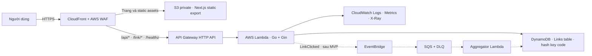
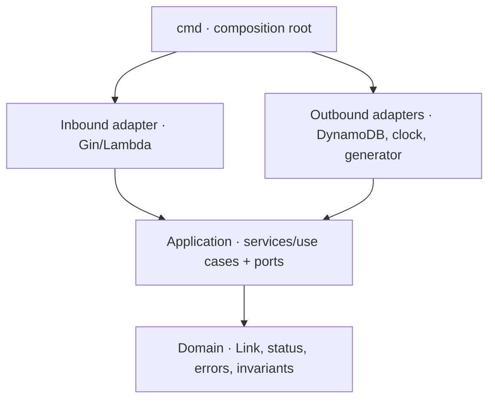
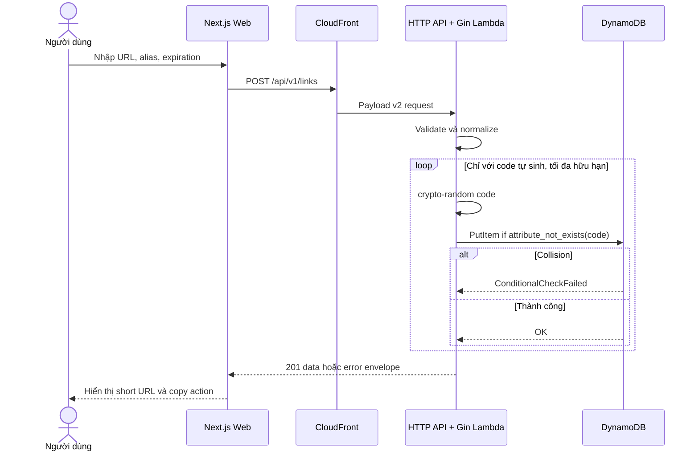
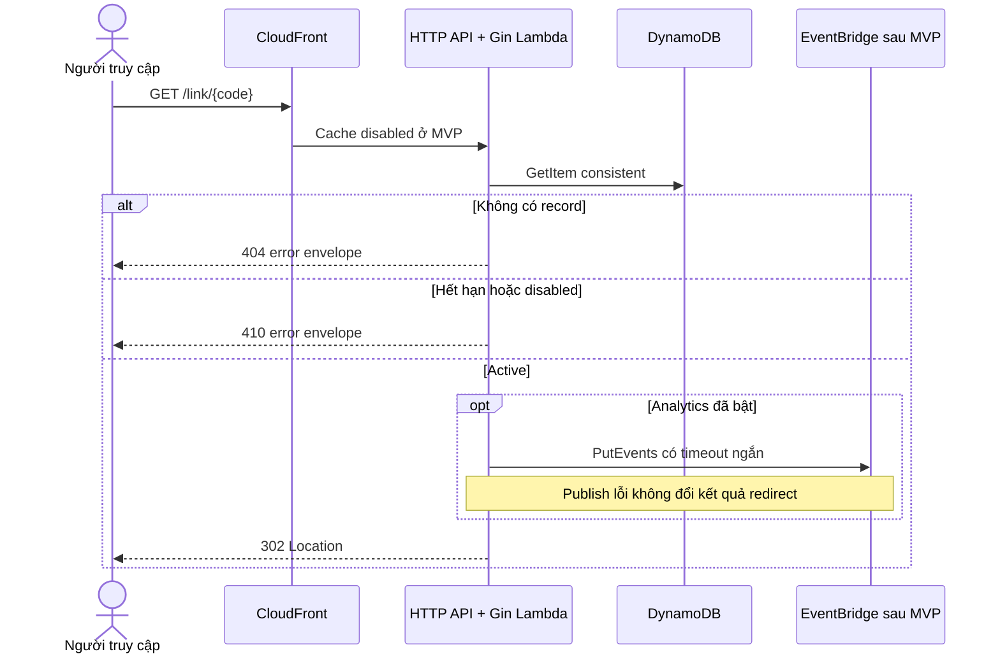
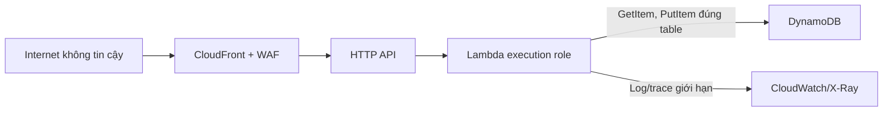

# Kiến trúc hệ thống `npt-shortenlink.dev`

> Tài liệu này mô tả kiến trúc đích và các quyết định cho MVP. Contract HTTP có tính chuẩn tắc tại [`openapi/openapi.yaml`](../openapi/openapi.yaml). Những mục ghi **sau MVP** chưa được coi là đã triển khai.

## 1. Mục tiêu kiến trúc

Hệ thống ưu tiên theo thứ tự:

1. Redirect đúng và nhanh; analytics không được làm hỏng tác vụ này.
2. Domain rule có thể test mà không khởi động Gin, Lambda hoặc DynamoDB.
3. Một contract HTTP cho cả local, staging và production.
4. Hạ tầng trả theo mức dùng, triển khai/xóa được bằng IaC.
5. Mặc định an toàn: TLS, least privilege, input chặt, log tối thiểu và rate limit.
6. Có bằng chứng quan sát và rollback trước khi tuyên bố production-ready.

## 2. System context



Bộ ảnh tham khảo ban đầu gợi ý chuỗi dịch vụ đầy đủ, nhưng MVP chỉ giữ đường ngắn `CloudFront → HTTP API → Lambda → DynamoDB`. EventBridge, SQS, Step Functions, Cognito và WebSocket chỉ được thêm khi có use case và tiêu chí thoát riêng.

Sơ đồ trên là kiến trúc đích. SAM hiện tại đã có CloudFront, S3, HTTP API, Lambda, DynamoDB, log group và active tracing cho Lambda; WAF, dashboard, alarm và trace end-to-end qua HTTP API/AWS SDK thuộc Phase 4, chưa được tuyên bố là đã triển khai.

## 3. Domain và route

### 3.1 DNS/TLS

- `npt-shortenlink.dev` là canonical public origin.
- `www.npt-shortenlink.dev` chuyển hướng vĩnh viễn về apex hoặc phục vụ cùng distribution; chọn một cách và kiểm thử canonical URL trước khi launch.
- Route 53 quản lý hosted zone nếu nameserver được chuyển sang AWS; nếu giữ DNS provider hiện tại thì tạo record tương đương theo output IaC.
- ACM certificate cho CloudFront phải ở `us-east-1`. Stack SAM hiện nhận `CertificateArn` và `HostedZoneId` của tài nguyên đã có qua parameter rồi tạo alias record; edge-bootstrap stack quản lý certificate/DNS validation đầy đủ là việc sau MVP và phải được ghi lại, không thao tác thủ công ẩn.
- Chỉ bật HSTS dài hạn và `includeSubDomains` sau khi mọi subdomain đang dùng đều có TLS đúng.

### 3.2 CloudFront behaviors

| Thứ tự | Path pattern | Origin | Method | Cache policy | Ghi chú |
|---:|---|---|---|---|---|
| 1 | `/api/*` | API Gateway HTTP API | contract dùng `GET/POST`; behavior forward bộ method chuẩn | disabled ở MVP | CloudFront chỉ có nhóm method cố định; route không khai báo vẫn bị HTTP API từ chối |
| 2 | `/link/*` | API Gateway HTTP API | `GET, HEAD, OPTIONS` | disabled ở MVP | tránh giữ redirect đã hết hạn; `GET` trả `302` |
| 3 | `/healthz` | API Gateway HTTP API | `GET, HEAD, OPTIONS` | disabled | liveness nhẹ, không query DynamoDB |
| 4 | `/*` | S3 private qua OAC | `GET, HEAD, OPTIONS` | hashed assets dài; HTML ngắn | fallback của Next.js static export |

Nhờ path routing cùng origin, trình duyệt gọi relative URL và không cần CORS trong production. CORS chỉ mở rõ ràng cho origin local/staging khi phát triển; không dùng `*` cho route tạo link.

### 3.3 HTTP routes

| Route | Trách nhiệm | Thành công | Lỗi nghiệp vụ chính |
|---|---|---:|---|
| `POST /api/v1/links` | tạo mã ngẫu nhiên hoặc custom alias | `201` | `400`, `409`, `503` |
| `GET /api/v1/links/{code}` | đọc metadata, kể cả trạng thái hết hạn/vô hiệu hóa | `200` | `404` |
| `GET /link/{code}` | resolve link đang active | `302 Location` | `404`, `410` |
| `GET /healthz` | liveness của process/router | `200` | lỗi hạ tầng sẽ do platform health/metric phát hiện |

`302` được chọn thay vì `301` để client/CDN không cache redirect lâu ngoài kiểm soát và để hỗ trợ disable/edit ở phiên bản sau. Metadata trả `status` (`active`, `expired`, `disabled`); redirect chỉ chấp nhận `active`.

## 4. Clean architecture

### 4.1 Dependency rule



Mũi tên chỉ hướng phụ thuộc mã nguồn. Domain không biết JSON, HTTP, Gin, AWS SDK hay biến môi trường. Application định nghĩa outbound port; adapter triển khai port; composition root chọn adapter theo môi trường.

### 4.2 Package ownership

| Lớp | Chứa | Không được chứa |
|---|---|---|
| `internal/domain` | `Link`, `LinkStatus`, invariant, domain errors | Gin context, JSON tag, AWS SDK, log |
| `internal/application/service` | create/metadata/resolve orchestration | HTTP status, DynamoDB expression |
| `internal/application/ports` | `LinkRepository`, `Clock`, `CodeGenerator` | concrete client/config |
| `internal/adapters/http/gin` | bind/validate shape HTTP, presenter, error mapping, middleware | DynamoDB query, business clock |
| `internal/adapters/repository/*` | memory/DynamoDB persistence | HTTP response hoặc UI copy |
| `internal/adapters/generator` | crypto-random code | repository retry policy ngoài use case |
| `cmd/*` | config validation, dependency injection, process lifecycle | domain rule |

### 4.3 Use cases và invariant

`CreateLink`:

- URL sau trim phải tuyệt đối, có hostname và scheme `http` hoặc `https`.
- Alias tùy chọn phải match `^[a-z0-9-]{4,32}$` và không thuộc reserved set.
- `expires_in_days`, nếu có, nằm trong `1..365`; `expires_at = created_at + N ngày` theo UTC.
- Mã tự sinh dùng `crypto/rand` và alphabet chữ thường + số.
- Repository create là atomic/conditional; use case retry hữu hạn khi mã tự sinh trùng, nhưng custom alias trùng trả ngay `409`.

`GetLinkMetadata`:

- Không có record trả `404`.
- Có record luôn trả metadata và trạng thái tính tại thời điểm đọc; vì vậy record hết hạn vẫn trả `200 status=expired` trong khoảng item chưa bị TTL xóa vật lý.

`ResolveLink`:

- Không có record trả `404`.
- `expired` hoặc `disabled` trả `410`.
- Chỉ `active` trả `302` cùng header `Location` là target URL đã lưu.

`Health`:

- Chỉ xác nhận process/router phản hồi và trả `{ "status": "ok" }`.
- Không gọi DynamoDB trong `/healthz`; dependency health được theo dõi bằng synthetic transaction và metric riêng, tránh biến lỗi phụ thuộc thành vòng restart Lambda.

## 5. Data model

### 5.1 Bảng DynamoDB

MVP cố ý dùng schema key-value tối thiểu, một bảng on-demand với hash key `code`:

| Thuộc tính | Ví dụ | Ý nghĩa |
|---|---|---|
| `code` | `k7m2qx` | partition key và mã public |
| `target_url` | `https://example.com/docs` | URL đích |
| `enabled` | `true` | cờ disable trong tương lai |
| `created_at` | RFC 3339 UTC | thời điểm tạo |
| `expires_at` | RFC 3339 UTC hoặc vắng | thời điểm nghiệp vụ hết hạn |
| `ttl` | epoch seconds hoặc vắng | DynamoDB TTL, bằng epoch của `expires_at` |

Không tạo sort key, GSI hoặc single-table item collection “để dành”. Khi analytics/account tạo ra access pattern mới, Phase 6 phải có migration/ADR riêng sang schema phù hợp, kèm partition key phân tán và estimate tải.

### 5.2 Expiration và TTL

DynamoDB TTL xóa bất đồng bộ, nên không được dùng để quyết định link còn hiệu lực. Domain luôn so `now >= expires_at`. Adapter hiện đặt `ttl` bằng epoch của `expires_at`: trong khoảng item đã hết hạn nhưng chưa bị DynamoDB xóa, metadata trả `200 status=expired` và redirect trả `410`; sau khi TTL xóa item, cả lookup không còn phân biệt được với mã chưa tồn tại và trả `404`.

Đây là giới hạn được chấp nhận của MVP, không phải cam kết `410` vô thời hạn. Nếu sản phẩm cần giữ `410` lâu hơn, phải chuyển `ttl` sang thời điểm purge muộn hơn hoặc dùng tombstone/retention theo ADR mới.

### 5.3 Consistency và collision

- Create: `PutItem` với `attribute_not_exists(code)`; không bao giờ read-then-write.
- Read MVP: consistent read để read-after-create xác định.
- Mã ngẫu nhiên collision: retry tối đa hữu hạn; hết lượt trả `503 code_generation_exhausted`.
- Custom alias collision: không retry bằng mã khác vì sẽ vi phạm ý định người dùng; trả `409 custom_alias_conflict`.

## 6. Luồng chính

### 6.1 Tạo liên kết



### 6.2 Redirect



Không chạy goroutine “fire-and-forget” sau khi Lambda trả response; runtime có thể đóng băng trước khi gửi event. Khi analytics được bật, `PutEvents` phải được await với timeout nhỏ, hoặc thay bằng cơ chế capture tách biệt; mọi failure phải quan sát được nhưng không biến thành `5xx` redirect.

## 7. AWS deployment

### 7.1 Compute và API

- API Gateway **HTTP API**, stage `$default`, payload format `2.0`.
- Một Lambda Go/Gin cho MVP để giảm số deployment unit và giữ clean application service; route splitting chỉ khi profile tải/quyền hạn cho thấy lợi ích thật.
- Runtime `provided.al2023`, binary tên `bootstrap`, kiến trúc `arm64` nếu dependency tương thích.
- Gin được nối qua adapter API Gateway v2; local composition root chạy `http.Server` và dùng cùng router/use case.
- Reserved concurrency chỉ đặt khi có số liệu; account concurrency và downstream capacity phải được theo dõi trước.

### 7.2 Web

- Next.js App Router được static export trong MVP vì trang chỉ cần client-side API call.
- Output đưa vào S3 private, CloudFront truy cập bằng OAC; bucket chặn public access.
- Asset có content hash dùng cache lâu/immutable; HTML dùng TTL ngắn và invalidation khi release.
- Nếu sau này cần SSR, ISR hoặc server action, mở ADR mới để chọn Amplify/OpenNext hoặc một Next origin khác; không lặng lẽ biến S3 thành origin không tương thích.

### 7.3 IaC và môi trường

- AWS SAM hiện khai báo API, Lambda, table, log groups, IAM, edge resources và output; alarm vẫn thuộc Phase 4 và phải được thêm bằng IaC trước production.
- `dev`, `staging`, `production` có stack/table/log riêng; không dùng chung dữ liệu.
- Parameter Store/Secrets Manager chỉ cho secret thật. Config không nhạy cảm là template parameter/environment variable có validate lúc boot.
- DynamoDB production bật point-in-time recovery; retention log/budget được khai báo rõ để tránh tài nguyên vô thời hạn ngoài ý muốn.

## 8. Security model

### 8.1 Trust boundaries



### 8.2 Kiểm soát bắt buộc cho MVP

- TLS-only; redirect HTTP sang HTTPS ở edge.
- AWS WAF managed rule set và rate-based rule; API Gateway throttle là lớp thứ hai.
- Giới hạn kích thước request trước khi JSON bind; từ chối content type không hỗ trợ.
- Chỉ chấp nhận URL `http/https`; từ chối scheme nguy hiểm và URL có embedded credentials/userinfo. Trước production cần quyết định rõ về localhost/private host và Unicode hostname.
- Alias allowlist ký tự, reserved-name set và atomic create.
- Response lỗi không chứa stack trace, table name, AWS request payload hoặc target URL.
- IAM theo action/resource: Lambda core chỉ cần read/write đúng bảng, log/trace; analytics permission chỉ thêm khi capability bật.
- DynamoDB encryption at rest và S3 server-side encryption; bucket block public access.
- Security headers cho web: CSP theo asset thực tế, `X-Content-Type-Options`, `Referrer-Policy`, frame policy phù hợp.
- Không log request body/full URL. Nếu cần correlation theo code, dùng hash/truncated identifier không đảo ngược trong log/metric.

### 8.3 Abuse và open redirect

Shortener chủ đích là một open redirect, vì vậy không thể “sửa” bằng cách cấm redirect ngoài domain. Kiểm soát đúng là:

- rate limit/quota và budget alarm;
- reporting/disable workflow;
- reserved alias và denylist có provenance;
- tùy chọn CAPTCHA/auth cho create khi abuse đo được tăng;
- safe-browsing check ở hàng đợi hoặc trước publish theo ADR riêng, với timeout/failure policy rõ ràng;
- trang legal/contact và quy trình phản hồi abuse trước launch công khai.

Cognito/JWT chưa nằm trong public MVP contract. Khi thêm account, owner ID phải đi vào key/access pattern và mọi lookup/update phải ràng buộc tenant để chặn IDOR; không chỉ ẩn nút ở frontend.

## 9. Reliability và hiệu năng

- Redirect path chỉ có một read bắt buộc; analytics là optional/failure-isolated.
- Timeout phải đi từ HTTP request xuống AWS SDK qua `context.Context`.
- Chỉ retry lỗi transient/throttling, có jitter và nằm trong tổng time budget; không retry lỗi validation/conditional conflict.
- Panic được recovery thành `500` an toàn và metric/log có request ID.
- CloudFront cache redirect tắt ở MVP. Chỉ bật sau khi có quy tắc TTL theo expiration, disable invalidation và analytics semantics.
- Load test dùng ramp/steady/spike có giới hạn; ghi cả seed, duration, region, concurrency, response distribution và chi phí ước tính từ traffic thật.
- Backup/restore DynamoDB phải được diễn tập, không chỉ bật PITR.

## 10. Observability

### 10.1 Structured log

Mỗi request log một event hoàn tất với các field ổn định:

```text
timestamp, level, service, env, request_id, trace_id,
route, method, status, latency_ms, cold_start, error_code
```

Không dùng raw path chứa code làm metric dimension; map về route template. Không log target URL, request body hoặc token.

### 10.2 Metrics và traces

- RED theo route template: request rate, error rate, duration.
- Lambda: errors, throttles, duration, concurrent executions, init duration/cold start.
- DynamoDB: system/user errors, throttled requests, consumed capacity khi cần điều tra.
- Domain counter: created, alias conflict, not found, expired/disabled redirect, code-generation exhausted.
- Analytics sau MVP: event publish failure, queue age, DLQ depth, partial batch failure.
- X-Ray: SAM hiện bật active tracing cho Lambda; trace end-to-end qua HTTP API/AWS SDK cần instrumentation hoặc kiến trúc bổ sung ở Phase 4, với sample rate theo môi trường/chi phí.

### 10.3 SLI, SLO và alarm

Các con số sau chỉ là **đề xuất ban đầu**, không phải tuyên bố hệ thống đã đạt:

- availability redirect theo response hợp lệ (`302/404/410`, loại trừ `4xx` do client theo định nghĩa đã duyệt);
- latency p95/p99 cho redirect và create tại edge/origin tách riêng;
- tỷ lệ `5xx`, throttle và event loss;
- freshness/queue age nếu analytics được bật.

Trước production, chủ dự án phải chốt mục tiêu số và error budget dựa trên load test. Alarm tối thiểu: 5xx/error-rate, p95 latency, Lambda throttle/error, DynamoDB throttle/system error, WAF spike và DLQ `> 0`. Mỗi alarm có owner, notification channel, runbook và bài test kích hoạt.

## 11. Error mapping

Mọi lỗi JSON theo dạng `{ "error": { "code", "message", "fields"? } }`.

| Domain/adapter error | HTTP | Public code |
|---|---:|---|
| JSON không hợp lệ | `400` | `invalid_request` |
| Body vượt 16 KiB | `413` | `payload_too_large` |
| Content type không phải `application/json` | `415` | `unsupported_media_type` |
| URL không hợp lệ | `400` | `invalid_url` |
| Alias sai format | `400` | `invalid_custom_alias` |
| Alias reserved | `400` | `reserved_custom_alias` |
| Expiration ngoài `1..365` | `400` | `invalid_expiration` |
| Custom alias đã tồn tại | `409` | `custom_alias_conflict` |
| Không tìm thấy link | `404` | `link_not_found` |
| Link hết hạn | `410` | `link_expired` |
| Link disabled | `410` | `link_disabled` |
| Không cấp được code sau retry | `503` | `code_generation_exhausted` |
| Lỗi không phân loại | `500` | `internal_error` |

WAF/API Gateway có thể trả `429`; edge error nên được chuẩn hóa về cùng envelope khi nền tảng cho phép. Client không suy luận từ message; chỉ branch bằng HTTP status và `error.code`.

## 12. Architecture Decision Records

### ADR-001 — Modular monolith với clean architecture

- **Trạng thái:** accepted cho MVP.
- **Quyết định:** một service Go, chia domain/application/adapters; một web app Next.js trong monorepo.
- **Lý do:** quy mô use case nhỏ, cần transaction/contract đơn giản và deployment nhanh; ranh giới package vẫn cho phép tách sau.
- **Đánh đổi:** một Lambda có blast radius lớn hơn function-per-route.
- **Revisit khi:** route có profile scaling/quyền IAM/SLO khác biệt rõ và số liệu chứng minh cần tách.

### ADR-002 — Gin trong một Lambda sau API Gateway HTTP API

- **Trạng thái:** accepted cho MVP.
- **Quyết định:** dùng HTTP API payload v2 và Gin adapter, thay vì REST API hoặc một Lambda cho mỗi route.
- **Lý do:** HTTP API đủ route/CORS/throttle cơ bản, ít cấu hình/chi phí hơn; Gin giữ local parity.
- **Đánh đổi:** framework routing thêm một lớp và cold-start bundle lớn hơn handler thuần.
- **Revisit khi:** cần feature riêng của REST API hoặc profiling cho thấy framework overhead đáng kể.

### ADR-003 — DynamoDB key-value tối thiểu, on-demand, conditional write

- **Trạng thái:** accepted cho MVP.
- **Quyết định:** hash key `code`, không sort key/GSI trong MVP; create dùng conditional write.
- **Lý do:** lookup theo code là access pattern chính; conditional write giải quyết collision atomic.
- **Đánh đổi:** query theo owner/target/date và analytics cần migration/index/item model mới sau này.
- **Revisit khi:** dashboard/account/analytics được chấp thuận và access pattern được định nghĩa; lúc đó mới cân nhắc single-table.

### ADR-004 — Expiration ở domain, DynamoDB TTL bằng `expires_at`

- **Trạng thái:** accepted.
- **Quyết định:** `expires_at` quyết định trạng thái khi item còn tồn tại; `ttl` bằng epoch của `expires_at` để DynamoDB dọn bất đồng bộ.
- **Lý do:** TTL không đảm bảo xóa đúng giây; tách hai khái niệm giữ behavior xác định.
- **Đánh đổi:** khoảng `410` không cố định; sau khi TTL xóa item sẽ chuyển thành `404`.
- **Revisit khi:** product/legal yêu cầu tombstone hoặc thời hạn `410` xác định; khi đó dùng purge grace/retention khác.

### ADR-005 — Một public origin, CloudFront route theo path

- **Trạng thái:** accepted cho MVP.
- **Quyết định:** apex phục vụ web và proxy `/api/*`, `/link/*`, `/healthz` tới HTTP API.
- **Lý do:** short URL đẹp, same-origin, không cần CORS production.
- **Đánh đổi:** CloudFront config/invalidation phức tạp hơn tách `api.` subdomain.
- **Revisit khi:** frontend cần SSR origin hoặc API cần lifecycle/domain độc lập.

### ADR-006 — Next.js static export trên S3 cho MVP

- **Trạng thái:** accepted có điều kiện.
- **Quyết định:** UI là client-rendered workbench; không server action/SSR.
- **Lý do:** private S3 + CloudFront đơn giản, rẻ và phù hợp luồng hiện tại.
- **Đánh đổi:** không có SSR/ISR và dynamic server route của Next.
- **Revisit khi:** SEO/dynamic page/account thực sự cần server rendering.

### ADR-007 — Redirect dùng `302`, không cache ở MVP

- **Trạng thái:** accepted.
- **Quyết định:** `GET /link/{code}` trả `302`; CloudFront không cache response.
- **Lý do:** expiration/disable chính xác và tránh client giữ permanent redirect.
- **Đánh đổi:** mỗi click chạm Lambda/DynamoDB, chi phí và latency cao hơn edge cache.
- **Revisit khi:** có traffic đo được và thiết kế invalidation/analytics đúng.

### ADR-008 — Analytics bất đồng bộ, sau MVP

- **Trạng thái:** proposed cho Phase 6.
- **Quyết định:** `LinkClicked` versioned qua EventBridge → SQS/DLQ → idempotent aggregator.
- **Lý do:** tách failure/scaling, hỗ trợ replay và partial batch failure.
- **Đánh đổi:** eventual consistency, event loss policy và vận hành DLQ.
- **Revisit khi:** yêu cầu analytics/SLO đã được chốt; Step Functions chỉ thêm nếu workflow thật sự nhiều bước.

### ADR-009 — Public create trước, Cognito sau

- **Trạng thái:** accepted cho MVP với guardrail.
- **Quyết định:** contract hiện tại không yêu cầu JWT; dùng WAF/rate limit và abuse process.
- **Lý do:** giảm scope để hoàn thành vertical slice.
- **Đánh đổi:** nguy cơ abuse/denial-of-wallet cao hơn.
- **Revisit khi:** abuse vượt ngưỡng, cần dashboard/ownership hoặc trước khi marketing rộng.

## 13. Nguồn tham khảo và giới hạn áp dụng

- [`nghiadaulau/serverless-url-shortener-aws`](https://github.com/nghiadaulau/serverless-url-shortener-aws) dùng SAM + TypeScript và chuỗi dịch vụ AWS tương tự. Dự án này tham khảo access pattern và tiến trình vận hành, không sao chép runtime/cấu trúc handler.
- [`Nutlope/hallmark`](https://github.com/Nutlope/hallmark) là nguồn cho kỷ luật giao diện. Hallmark chỉ quản phần visual/interaction; business logic, security và AWS vẫn tuân theo kiến trúc ở tài liệu này.
