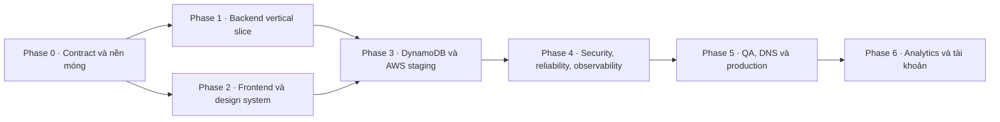

# Kế hoạch và trạng thái triển khai `npt-shortenlink.dev`

> Cập nhật ngày 26/07/2026: Next.js và OpenAPI là baseline đang hoạt động.
> Backend Go và AWS infrastructure được rollback khỏi cây source để đưa lại
> bằng các pull request nhỏ, có dependency và validation rõ ràng. Thứ tự review
> nằm tại [`docs/backend-infra-pr-plan.md`](./backend-infra-pr-plan.md).
> Phase 4–5 vẫn là gate bắt buộc trước production; Phase 6 nằm ngoài MVP.
> Contract HTTP chuẩn nằm tại [`openapi/openapi.yaml`](../openapi/openapi.yaml);
> quyết định kiến trúc nằm tại [`docs/architecture.md`](./architecture.md); cổng
> kiểm chứng giao diện nằm tại [`docs/hallmark-qa.md`](./hallmark-qa.md).

| Phase | Trạng thái source | Gate còn lại |
|---|---|---|
| 0 · Contract và nền móng | Hoàn thành | Duy trì lint/contract review trong CI |
| 1 · Backend vertical slice | Đang review lại theo capability | Merge tuần tự backend PR; duy trì test, race test và security scan |
| 2 · Frontend/design system | Hoàn thành | Duy trì lint/build và Hallmark evidence |
| 3 · DynamoDB/AWS staging | Đang review lại theo resource group | Merge tuần tự infrastructure PR, sau đó validate/build trước staging |
| 4 · Security/reliability/observability | Chưa hoàn thành | WAF, alarm, dashboard, load/SLO và runbook |
| 5 · DNS/production | Chưa bắt đầu | Staging sign-off, cutover và rollback rehearsal |
| 6 · Analytics/tài khoản | Ngoài MVP | Chỉ mở khi có capability/acceptance criteria riêng |

## 1. Mục tiêu và ranh giới

MVP phải hoàn thành một lát cắt dọc có thể chạy từ trình duyệt đến kho dữ liệu:

1. Nhập một URL đích hợp lệ và tạo mã rút gọn ngẫu nhiên.
2. Cho phép alias tùy chọn gồm `4–32` ký tự thường, chữ số hoặc dấu gạch ngang.
3. Cho phép thời hạn tùy chọn từ `1–365` ngày.
4. Trả metadata của liên kết qua `GET /api/v1/links/{code}`.
5. Chuyển hướng công khai bằng `302 Location` qua `GET /link/{code}`.
6. Trả `404` cho mã không tồn tại và `410` cho liên kết đã hết hạn hoặc bị vô hiệu hóa.
7. Có trang Next.js responsive, có đầy đủ trạng thái nhập liệu, loading, lỗi và kết quả.
8. Có triển khai AWS lặp lại được, quan sát được và có đường lui khi phát hành lỗi.

Các mục sau **không chặn MVP**: tài khoản người dùng, dashboard nhiều liên kết, sửa/xóa liên kết, custom domain cho khách hàng, WebSocket và phân tích click thời gian thực. Chúng thuộc Phase 6 sau khi luồng redirect cốt lõi ổn định.

## 2. Đầu vào thiết kế

- Tên miền sản phẩm: `npt-shortenlink.dev`.
- Backend: Go `1.26.5+`, Gin, clean architecture; chạy local như HTTP server và đóng gói thành một Lambda cho AWS.
- Frontend: Next.js App Router, TypeScript strict, quản lý bằng `pnpm`; baseline hiện tại là Next.js `16` và pnpm `10`.
- Bộ ảnh tham khảo ban đầu (đã xóa khỏi repository sau khi chắt lọc) cung cấp hai loại tín hiệu:
  - tín hiệu hệ thống: HTTP API, Lambda, DynamoDB single-table, conditional write, TTL, EventBridge, SQS/DLQ, Cognito, WAF, CloudWatch/X-Ray, load test và canary;
  - tín hiệu thị giác: nền xanh đen, chữ sáng, accent xanh lam tiết chế, bố cục editorial kỹ thuật, đường viền mảnh và mật độ thông tin cao.
- Không sao chép giao diện hoặc source theo pixel/dòng. Ta chỉ chuyển hóa các nguyên tắc phù hợp với bài toán rút gọn URL.

## 3. Cấu trúc đích

```text
.
├── apps/
│   └── web/                         # Next.js UI
├── services/
│   └── shortener-api/
│       ├── cmd/                     # composition root cho local và Lambda
│       └── internal/
│           ├── domain/              # entity, invariant, domain errors
│           ├── application/         # use case và outbound ports
│           └── adapters/            # Gin, DynamoDB, clock, code generator
├── infra/                            # AWS SAM và cấu hình môi trường
├── openapi/
│   └── openapi.yaml                 # HTTP contract duy nhất
└── docs/
    ├── implementation-plan.md
    ├── architecture.md
    └── hallmark-qa.md
```

Quy tắc phụ thuộc: `domain` không import framework/AWS; `application` chỉ phụ thuộc `domain` và interface port; adapter phụ thuộc vào các lớp phía trong; `cmd` là nơi duy nhất lắp ghép concrete implementation.

## 4. Đồ thị thực hiện



Phase 1 và Phase 2 có thể chạy song song sau khi OpenAPI được khóa. Không triển khai analytics trước khi redirect path có SLO, alarm và load-test baseline.

## 5. Kế hoạch theo phase

### Phase 0 — Khóa contract và nền móng

Các bước:

1. Chốt bốn route MVP và schema lỗi thống nhất trong OpenAPI.
2. Ghi ADR, ranh giới clean architecture, route của domain và data model DynamoDB.
3. Chuẩn hóa workspace: một lockfile pnpm ở root, script root gọi web/API, không trộn npm/yarn.
4. Chốt biến môi trường và giá trị mặc định local; cung cấp `.env.example`, tuyệt đối không commit secret.
5. Chốt Definition of Done và format báo cáo Hallmark trước khi làm UI.

Đầu ra:

- OpenAPI lint được.
- Cây package và hướng phụ thuộc được thống nhất.
- Danh sách config runtime đã chốt: `PUBLIC_BASE_URL`, `STORAGE_DRIVER`, `LINKS_TABLE_NAME`, `CORS_ALLOWED_ORIGINS`; local server nhận thêm `HTTP_ADDR` hoặc `PORT`, còn AWS region đi qua provider chain.
- Quy ước lỗi, request ID, log field và thời gian RFC 3339 được thống nhất.

Exit criteria:

- [x] Mọi ví dụ request/response trong tài liệu khớp OpenAPI.
- [x] Frontend và backend cùng dùng `/api/v1/links`, không có contract song song.
- [x] Không còn quyết định kiến trúc bắt buộc nào bị để ngầm.
- [x] `pnpm install --frozen-lockfile` chạy từ root mà không tạo lockfile thứ hai.

### Phase 1 — Backend vertical slice chạy local

Các bước:

1. Hoàn thiện entity `Link`, trạng thái `active/expired/disabled` và domain error.
2. Hoàn thiện các use case `CreateLink`, `GetLinkMetadata`, `ResolveLink`.
3. Dùng `crypto/rand` tạo code chữ thường và số; retry hữu hạn khi conditional create bị trùng.
4. Validate URL tuyệt đối chỉ với `http`/`https`; normalize khoảng trắng và scheme; từ chối alias reserved.
5. Cài memory repository cho test/local và Gin adapter cho bốn route.
6. Ánh xạ lỗi tập trung thành error envelope; không để chi tiết lỗi nội bộ lọt ra response.
7. Thêm middleware request ID, recovery, timeout và structured logging.

Kiểm thử bắt buộc:

- Unit test cho URL, alias, expiration, collision retry và trạng thái tại đúng biên thời gian hết hạn.
- Handler test cho `201`, `200`, `302`, `400`, `404`, `409`, `410`, `503` và JSON lỗi.
- Repository contract test chạy giống nhau với memory adapter và DynamoDB adapter ở Phase 3.
- `go test -race ./services/shortener-api/...`.

Exit criteria:

- [x] Bốn route local khớp OpenAPI, bao gồm `Location` của `302`.
- [x] Cùng một alias được tạo đồng thời chỉ có một request thành công.
- [x] Không package nào trong `domain` hoặc `application` import Gin/AWS SDK.
- [x] Log không chứa full target URL, request body hoặc secret.
- [x] Tất cả test backend và race detector pass.

### Phase 2 — Frontend Next.js và design system

Các bước:

1. Dùng các tín hiệu thị giác đã chắt lọc để tạo token có nghĩa: paper/ink/accent/border/focus, font display/body, spacing 4 px và motion token.
2. Xây trang theo mô hình **workbench kỹ thuật**, không dùng chuỗi AI mặc định “hero giữa trang → ba card bằng nhau → CTA → footer”. Form rút gọn là hành động chính ngay trong first screen.
3. Tạo client API typed theo OpenAPI và một lớp chuyển lỗi API thành message cho người dùng.
4. Cài đủ trạng thái cho input và nút: default, hover, focus-visible, active, disabled, loading, error, success.
5. Hiển thị kết quả với short URL, target URL, ngày tạo/hết hạn và thao tác copy có thông báo im lặng trong ngữ cảnh.
6. Đảm bảo semantic HTML, label thật, live region có kiểm soát, keyboard navigation và reduced motion.
7. Chạy toàn bộ quy trình tại [`docs/hallmark-qa.md`](./hallmark-qa.md); audit không được tự động sửa code.

Exit criteria:

- [x] `pnpm lint:web` và `pnpm build:web` pass từ root.
- [x] Không có horizontal scroll ở `320`, `375`, `414`, `768` và khi quét liên tục đến `1920` px.
- [x] First screen tại `1280×800` thấy được headline, diễn giải, form và primary action không cần cuộn.
- [x] Keyboard-only hoàn thành được luồng tạo và copy link.
- [x] Hallmark self-critique có mọi trục `>= 3`; gate sweep có bằng chứng `58/58`; audit phát hành là `0 critical · 0 major · 0 minor`.

### Phase 3 — DynamoDB và AWS staging

Các bước:

1. Hoàn thiện DynamoDB adapter MVP với partition key đơn `code` và `ConditionExpression=attribute_not_exists(code)`.
2. Dùng consistent read trên redirect/metadata trong MVP để tránh đọc hụt ngay sau khi tạo.
3. Lưu `created_at`, `expires_at` theo UTC RFC 3339 và `ttl = expires_at` dạng epoch cho DynamoDB TTL; domain vẫn kiểm `expires_at`, không dùng việc item còn/tắt trong bảng làm logic hết hạn.
4. Tạo composition root cho local HTTP và Lambda; đóng gói Gin bằng API Gateway payload v2 adapter.
5. Khai báo SAM: HTTP API, Lambda `arm64`, DynamoDB on-demand, log group retention, IAM tối thiểu và output cần thiết.
6. Build Next.js dạng static export cho MVP, đưa vào S3 private qua Origin Access Control.
7. Dựng CloudFront path routing tới S3 và HTTP API; tạo staging stack tách biệt production.

Exit criteria:

- [ ] Deploy staging chỉ bằng IaC, không chỉnh tay resource bắt buộc trong console.
- [ ] Smoke test từ CloudFront đi qua đủ `POST → GET metadata → 302`.
- [ ] Hai request đồng thời dùng cùng alias cho kết quả xác định `201 + 409`.
- [ ] Link hết hạn trả `410` trong khoảng item vẫn còn trước khi TTL dọn; sau khi DynamoDB xóa item thì trả `404`, đúng giới hạn đã ghi trong kiến trúc.
- [ ] Lambda role chỉ có action/bảng/resource cần thiết.
- [ ] Xóa staging stack không để lại tài nguyên tính phí ngoài các resource được ghi rõ là retained.

### Phase 4 — Security, reliability và observability

Các bước:

1. Áp WAF managed rules, rate-based rule và API Gateway throttling; đặt giới hạn body nhỏ cho create request.
2. Cấu hình HTTPS-only, HSTS sau khi xác nhận toàn bộ subdomain dùng TLS, CSP cho web và CORS chỉ cho origin cần thiết.
3. Thêm timeout budget cho handler/AWS SDK, retry có jitter chỉ với lỗi retryable; redirect không retry vô hạn.
4. Bật CloudWatch structured logs, X-Ray trace, custom metrics có cardinality thấp và dashboard theo route/status.
5. Tạo alarm cho 5xx, latency, Lambda throttle/error, DynamoDB throttle/system error và WAF block spike.
6. Chạy load test theo traffic ramp; kiểm tra cold start, concurrency, hot code và giới hạn tài khoản.
7. Chạy threat review: abuse/phishing, alias enumeration, open redirect, log injection, denial of wallet và secret exposure.

Exit criteria:

- [ ] Không có secret/URL đầy đủ/PII trong log và metric dimension.
- [ ] Mỗi request tra được bằng `request_id` xuyên Gin, Lambda và log.
- [ ] Dashboard và alarm được tạo bằng IaC; alarm có bài test kích hoạt và đường xử lý.
- [ ] Load test đạt target đã được chủ dự án phê duyệt; báo cáo lưu cả cấu hình lẫn kết quả, không chỉ ghi “pass”.
- [ ] Kịch bản DynamoDB/Lambda lỗi trả envelope an toàn và không làm lộ stack trace.
- [ ] Security checklist không còn mục critical/high mở.

### Phase 5 — Release, DNS và vận hành production

Các bước:

1. Pipeline PR chạy lint, typecheck/build, unit/integration test, OpenAPI lint, IaC validation và dependency scan.
2. Pipeline release deploy staging, smoke test, sau đó mới promote cùng artifact sang production.
3. Dùng canary hoặc weighted alias cho Lambda; tự rollback khi error/latency alarm vượt ngưỡng đã chốt.
4. Cấp ACM certificate, trỏ apex/`www` vào CloudFront và kiểm tra DNS/TLS trước khi bật HSTS dài hạn.
5. Chạy smoke test production, Hallmark audit cuối, accessibility scan và kiểm chứng từng viewport.
6. Viết runbook rollback, incident, alias abuse report, TTL cleanup và restore DynamoDB.

Exit criteria:

- [ ] `https://npt-shortenlink.dev` phục vụ web; các path API/redirect đi đúng origin như bảng route trong kiến trúc.
- [ ] Artifact production đúng digest đã pass staging; rollback đã được diễn tập.
- [ ] Route `healthz`, create, metadata và redirect đều có synthetic check.
- [ ] Hallmark report cuối đáp ứng ngưỡng phát hành và dẫn được tới screenshot/evidence thật.
- [ ] CloudWatch alarm có owner và notification channel; runbook truy cập được khi CI/CD hỏng.
- [ ] Không còn thay đổi console chưa được đưa ngược về IaC.

### Phase 6 — Mở rộng sau MVP

Thực hiện từng capability độc lập, không buộc redirect path phụ thuộc vào analytics:

1. Phát `LinkClicked` lên EventBridge theo schema versioned; nếu publish lỗi, redirect vẫn thành công và tăng metric thất thoát event.
2. Route event vào SQS với DLQ; consumer xử lý idempotent và hỗ trợ partial batch failure.
3. Thiết kế migration sang single-table/item collection và aggregate theo bucket thời gian trong DynamoDB; chỉ thêm GSI khi có access pattern cụ thể.
4. Thêm Cognito/JWT cho dashboard và ownership key để chặn IDOR; các route public hiện tại giữ contract tương thích.
5. Thêm realtime qua WebSocket chỉ khi dashboard thật sự cần push; polling đơn giản được ưu tiên trước.
6. Thêm edit/disable/delete, custom domains và safe-browsing theo ADR/API version mới.

Exit criteria cho từng capability:

- [ ] Có contract/event schema versioned và migration/rollback.
- [ ] Có idempotency test, DLQ replay test và cost estimate dựa trên tải đo được.
- [ ] Không làm tăng đáng kể latency/error budget của redirect; nếu có, capability phải tách hoặc tắt được.

## 6. Definition of Done cho mỗi PR

Một PR chỉ được xem là hoàn tất khi:

- thay đổi bám một use case/ADR rõ ràng và không phá hướng phụ thuộc clean architecture;
- OpenAPI, test và implementation được cập nhật cùng nhau khi contract đổi;
- backend pass format, vet, unit/integration và race test phù hợp;
- frontend chỉ dùng pnpm, pass lint/build/test, không sinh lockfile khác;
- lỗi có mã ổn định, log có request ID và không chứa dữ liệu nhạy cảm;
- thay đổi UI có keyboard/reduced-motion/responsive evidence và Hallmark report trung thực;
- IaC change có diff/validation, rollback và không cấp wildcard IAM nếu có thể chỉ rõ resource;
- tài liệu và runbook được cập nhật trước khi merge, không ghi nhận tính năng chưa chạy như đã hoàn thành.

## 7. Rủi ro cần theo dõi

| Rủi ro | Tác động | Kiểm soát đầu tiên | Dấu hiệu cần nâng cấp |
|---|---|---|---|
| Dịch vụ bị dùng để phát tán link độc hại | Uy tín/domain bị chặn | rate limit, báo cáo abuse, denylist reserved, log tối thiểu | tỷ lệ block/report tăng hoặc domain bị provider cảnh báo |
| Alias/code bị trùng | Tạo link thất bại hoặc ghi đè | conditional write + retry hữu hạn | conflict của mã ngẫu nhiên vượt baseline |
| TTL DynamoDB xóa bất đồng bộ | `410` chỉ tồn tại trong khoảng item chưa bị xóa, sau đó là `404` | application kiểm `expires_at`; contract/runbook ghi rõ giới hạn TTL | cần tombstone hoặc retention `410` dài hơn |
| Link nổi tiếng tạo hot key | latency/throttle redirect | CloudWatch theo consumed capacity, cân nhắc cache có TTL ngắn | một code chiếm tỷ lệ lớn traffic hoặc DynamoDB throttle |
| Analytics làm chậm redirect | giảm độ tin cậy tác vụ chính | triển khai sau MVP, failure-isolated | p95/5xx tăng khi bật event publishing |
| Cache giữ redirect đã hết hạn | chuyển hướng sai | cache tắt ở MVP | chỉ bật khi có invalidation và TTL nhỏ hơn thời hạn còn lại |
| Chi phí tăng bất ngờ | denial of wallet | budget alarm, WAF/rate limit, on-demand baseline | request/WAF/DynamoDB tăng ngoài forecast đo được |

## 8. Tài liệu tham khảo

- [`nghiadaulau/serverless-url-shortener-aws`](https://github.com/nghiadaulau/serverless-url-shortener-aws): tham khảo tiến trình serverless và các thành phần AWS; dự án này chuyển runtime sang Go/Gin và giữ domain độc lập hạ tầng.
- [`Nutlope/hallmark`](https://github.com/Nutlope/hallmark): tham khảo quy trình chống giao diện rập khuôn; checklist thực thi của dự án được ghim theo skill cục bộ và mô tả tại [`docs/hallmark-qa.md`](./hallmark-qa.md).
